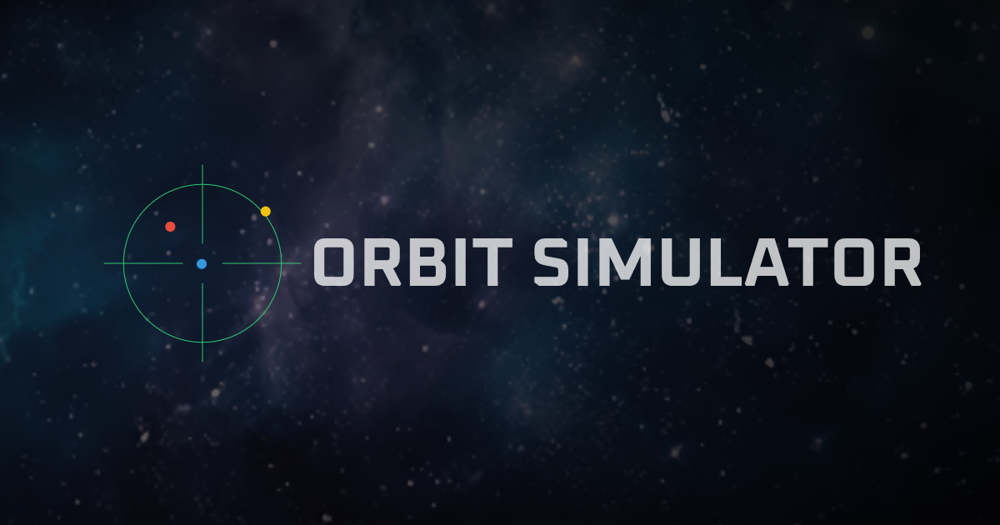

# ORBIT SIMULATOR
A real-time orbital simulator of the Earth, Moon, and a satellite, built using pure JavaScript and HTML5 Canvas.

This simulator models the Newtonian gravitational interactions between three bodies in a 2D plane, providing real-time updates of positions and velocities. It also allows you to freely change the perspective and adjust the mass, position and velocity of each celestial body from the user interface.

天体（地球・月・衛星）の軌道シミュレータです。\
ライブラリやフレームワークを用いず、素の JavaScript と HTML5 Canvas のみを用いて制作しました。

平面上の 3 天体間の重力相互作用をモデル化し、位置と速度をリアルタイムに描画します。\
視点を切り替えることも可能で、空間に固定された座標視点と、地球から月の方向を固定した視点を選択できます。\
設定パネルから各天体の質量・初期座標・初速度も自由にカスタマイズ可能です。

## Live Demo / デモ
https://storage.googleapis.com/orbitsim/index.html

## Features / 主な機能
- Real-time simulation of gravitational interactions / 重力による三体運動（地球・月・衛星）をリアルタイムで描画
- Interactive parameter control (mass, position, velocity etc.) / 質量・初期座標・初速度などのパラメータを自由に調整可能
- Trajectory trails with fading segments / フェードする軌道の軌跡描画機能
- View lock mode: Earth-fixed perspective / 地球を中心とした視点で、月の方向を固定する視点切替モード
- Zoom and speed controls / ズーム・速度の調整
- Intuitive UI for desktop and mobile / PC・スマートフォンどちらでも使える UI

## Physics Model / 物理モデル
- Newtonian gravitational simulation / ニュートン力学に基づいた重力シミュレーション
- Fourth-order Runge-Kutta method / 高精度なルンゲ＝クッタ法（4次）による数値計算
- Scaled units and realistic mass ratio (81.3 : 1) / 実際の地球と月の質量比 (81.3 : 1) に基づいたスケーリング
- Adjustable accuracy and trajectory duration / シミュレーション精度と軌跡時間の調整可能

## Technologies Used / 技術スタック
- HTML / CSS / JavaScript (Vanilla JS) - No external libraries. Implemented using only plain JS and HTML/CSS. / 外部ライブラリなし、純粋な JS と HTML/CSS のみで実装
- Canvas API (2D rendering) / 2D 描画用 Canvas API
- Original UI components with mobile support / モバイル対応の自作 UI コンポーネント

## Repository Structure / ファイル構成
- `assets/` - images, icons, and OGP / 背景画像・ファビコン・OGP 用画像など
- `index.html` - main file with embedded logic / メインの HTML・JS・CSS を含む単一ファイル構成
- `manifest.json` - basic PWA support / 簡易的な PWA 対応

## License / ライセンス
[MIT License](LICENSE)

## Author / 制作者
&copy;2025 [SUWA Hiroyuki / 諏訪宏幸](https://github.com/hiroyuki-suwa/)
